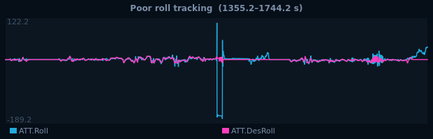
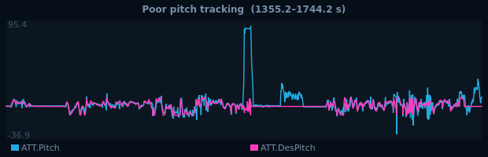
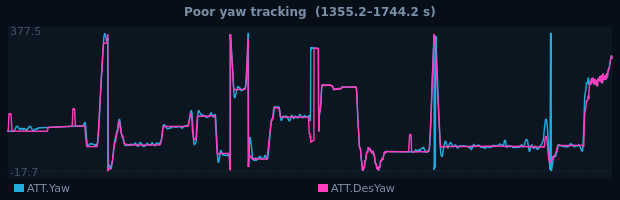
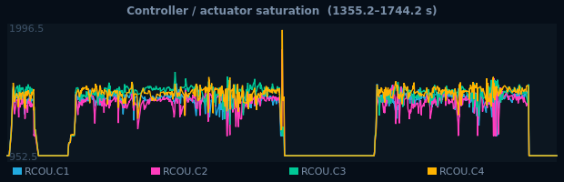
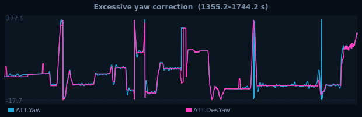
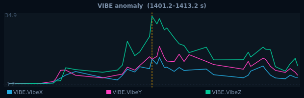
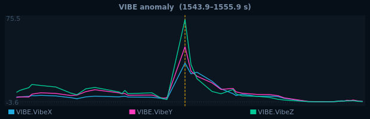
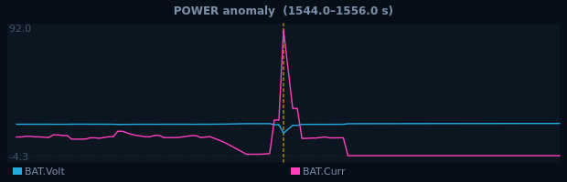

# TARAlytics — Investigation Evidence

**Log:** logs/00000011.BIN  
**Generated:** 2026-06-04T12:09:32  
**Aircraft:** — · ArduCopter V4.6.3 · QUAD/X  
**Verification:** NOT_LOADED  
**Assessment:** MARGINAL (59/100)  
**Snapshots:** 2

---

## Conclusion

**Verdict: MARGINAL (59/100)**

Marginal flight — review the findings.

Drivers: tracking 22 · saturation

| Category | Score | Grade |
|---|---|---|
| **Overall** | **62** | **D** |
| Attitude tracking | 22 | F |
| Control smoothness | 90 | A |
| Yaw discipline | 55 | F |
| Landing quality | 80 | B |

**Flight:** 3 flight(s), 298 s armed.

---

## Findings (11)

### 1. [ERROR] ERR — ERR anomaly

Subsys=12 ECode=1 @ 1552.3 s

**Supporting evidence:** `ERR`

---

### 2. [ERROR] ERR — ERR anomaly

Subsys=25 ECode=1 @ 1725.6 s

**Supporting evidence:** `ERR`

---

### 3. [WARNING] TRACKING — Poor roll tracking

Roll demand-vs-response RMS 15.5°, only 93% in tolerance

**Supporting evidence:** `ATT.Roll`, `ATT.DesRoll`

---

### 4. [WARNING] TRACKING — Poor pitch tracking

Pitch demand-vs-response RMS 9.4°, only 91% in tolerance

**Supporting evidence:** `ATT.Pitch`, `ATT.DesPitch`

---

### 5. [WARNING] TRACKING — Poor yaw tracking

Yaw demand-vs-response RMS 16.9°, only 75% in tolerance

**Supporting evidence:** `ATT.Yaw`, `ATT.DesYaw`

---

### 6. [WARNING] SATURATION — Controller / actuator saturation

Saturated 8% of armed time (motors 8%, output 0%)

**Supporting evidence:** `RCOU.C1-4`, `RATE.ROut/POut/YOut`

---

### 7. [WARNING] YAW — Excessive yaw correction

Yaw discipline score 55 (67 large yaw inputs)

**Supporting evidence:** `ATT.Yaw`, `ATT.DesYaw`, `RCIN(yaw)`

---

### 8. [WARNING] VIBE — VIBE anomaly

High vibration VibeZ=71.9 m/s² @ 1407.2 s

**Supporting evidence:** `VIBE`

---

### 9. [WARNING] VIBE — VIBE anomaly

High vibration VibeX=46.2 m/s² @ 1549.9 s

**Supporting evidence:** `VIBE`

---

### 10. [WARNING] VIBE — VIBE anomaly

High vibration VibeY=54.4 m/s² @ 1549.9 s

**Supporting evidence:** `VIBE`

---

### 11. [WARNING] POWER — POWER anomaly

Low battery 15.8 V @ 1550.0 s

**Supporting evidence:** `POWER`

---

## Investigation Snapshots

## Snapshot 1 — ERR: ERR: Subsys_12 code=1

**Status:** FLAGGED  ·  **Captured:** 2026-06-04T12:09:31  ·  **Flight time:** 1552.26 s  ·  **Flight window:** 2 / 3

**Event:** ERR: ERR: Subsys_12 code=1 @ 1552.26 s

| Field | Value |
|---|---|
| Phase | HOVER |
| Mode | LOITER |
| Position | 17.439680, 78.746050 |
| Altitude (AGL) | -0.2 m (POS.RelHomeAlt) |
| Vertical speed | -0.19 m/s (BARO[0].CRt) |
| Ground speed | 0.2 m/s |
| GPS | DGPS · 27 sats |
| EKF health | OK (ratio 0.10, SM) |
| Position divergence | 0.14 m (OK) |
| Verification | NOT_LOADED |

**Control — Pilot / Demand / Actual:**

| Axis | Pilot | Demand | Actual | Δ |
|---|---|---|---|---|
| Roll | +0.00 | -2° | -166° | 164° |
| Pitch | +0.00 | -2° | +86° | 88° |
| Yaw | -1.00 | +229° | +319° | 90° |
| Throttle | 0.00 | — | 0.00 | — |

**Notes:** auto from finding: ERR anomaly

Data provenance (25 sampled values)

| Field | Source | Value | Sample t (s) | Interp. | Bracket (s) |
|---|---|---|---|---|---|
| pilot_roll | RCIN.C1 | 1501 | — | yes | 1551.796–1552.296 |
| servo_roll | RCOU.C1 | 1000 | — | yes | 1551.796–1552.296 |
| pilot_pitch | RCIN.C2 | 1501 | — | yes | 1551.796–1552.296 |
| servo_pitch | RCOU.C2 | 1000 | — | yes | 1551.796–1552.296 |
| pilot_yaw | RCIN.C4 | 1051 | — | yes | 1551.796–1552.296 |
| servo_yaw | RCOU.C4 | 1000 | — | yes | 1551.796–1552.296 |
| pilot_throttle | RCIN.C3 | 1051 | — | yes | 1551.796–1552.296 |
| servo_throttle | RCOU.C3 | 1000 | — | yes | 1551.796–1552.296 |
| demand_roll | ATT.DesRoll | -2.28 | — | yes | 1552.196–1552.296 |
| demand_pitch | ATT.DesPitch | -1.635 | — | yes | 1552.196–1552.296 |
| demand_yaw | ATT.DesYaw | 229.4 | — | yes | 1552.196–1552.296 |
| demand_throttle | CTUN.ThO | — | — | no | — |
| response_roll | ATT.Roll | -165.8 | — | yes | 1552.196–1552.296 |
| response_pitch | ATT.Pitch | 86.22 | — | yes | 1552.196–1552.296 |
| response_yaw | ATT.Yaw | 319.5 | — | yes | 1552.196–1552.296 |
| altitude_agl | POS.RelHomeAlt | -0.216 | — | yes | 1551.796–1552.296 |
| vertical_speed | BARO[0].CRt | -0.1863 | — | yes | 1552.196–1552.296 |
| ground_speed | GPS[0].Spd | 0.1954 | — | yes | 1551.556–1552.356 |
| gps_status | GPS[0].Status | 4 | 1551.556 | no | — |
| gps_sats | GPS[0].NSats | 27 | 1551.556 | no | — |
| position_lat | GPS[0].Lat | 17.44 | — | yes | 1551.556–1552.356 |
| position_lng | GPS[0].Lng | 78.75 | — | yes | 1551.556–1552.356 |
| ekf_worst | XKF4[0].SM | 0.1 | — | yes | 1552.195–1552.295 |
| posdiv_ipn | XKF3[0].IPN | -0.02 | — | yes | 1551.795–1552.295 |
| posdiv_ipe | XKF3[0].IPE | 0.1407 | — | yes | 1551.795–1552.295 |

---
## Snapshot 2 — ERR: ERR: Subsys_25 code=1

**Status:** FLAGGED  ·  **Captured:** 2026-06-04T12:09:31  ·  **Flight time:** 1725.59 s  ·  **Flight window:** 3 / 3

**Event:** ERR: ERR: Subsys_25 code=1 @ 1725.59 s

| Field | Value |
|---|---|
| Phase | HOVER |
| Mode | LOITER |
| Position | 17.439810, 78.746223 |
| Altitude (AGL) | 2.4 m (POS.RelHomeAlt) |
| Vertical speed | -0.46 m/s (BARO[0].CRt) |
| Ground speed | 0.6 m/s |
| GPS | DGPS · 30 sats |
| EKF health | OK (ratio 0.06, SV) |
| Position divergence | 0.06 m (OK) |
| Verification | NOT_LOADED |

**Control — Pilot / Demand / Actual:**

| Axis | Pilot | Demand | Actual | Δ |
|---|---|---|---|---|
| Roll | +0.00 | -9° | +2° | 11° |
| Pitch | +0.00 | +2° | +9° | 7° |
| Yaw | +0.00 | +67° | +76° | 8° |
| Throttle | 0.00 | — | 0.00 | — |

**Notes:** auto from finding: ERR anomaly

Data provenance (25 sampled values)

| Field | Source | Value | Sample t (s) | Interp. | Bracket (s) |
|---|---|---|---|---|---|
| pilot_roll | RCIN.C1 | 1501 | — | yes | 1725.496–1725.696 |
| servo_roll | RCOU.C1 | 1000 | — | yes | 1725.496–1725.696 |
| pilot_pitch | RCIN.C2 | 1501 | — | yes | 1725.496–1725.696 |
| servo_pitch | RCOU.C2 | 1000 | — | yes | 1725.496–1725.696 |
| pilot_yaw | RCIN.C4 | 1495 | — | yes | 1725.496–1725.696 |
| servo_yaw | RCOU.C4 | 1000 | — | yes | 1725.496–1725.696 |
| pilot_throttle | RCIN.C3 | 1051 | — | yes | 1725.496–1725.696 |
| servo_throttle | RCOU.C3 | 1000 | — | yes | 1725.496–1725.696 |
| demand_roll | ATT.DesRoll | -9.314 | — | yes | 1725.496–1725.596 |
| demand_pitch | ATT.DesPitch | 1.636 | — | yes | 1725.496–1725.596 |
| demand_yaw | ATT.DesYaw | 67.49 | — | yes | 1725.496–1725.596 |
| demand_throttle | CTUN.ThO | — | — | no | — |
| response_roll | ATT.Roll | 2.08 | — | yes | 1725.496–1725.596 |
| response_pitch | ATT.Pitch | 8.804 | — | yes | 1725.496–1725.596 |
| response_yaw | ATT.Yaw | 75.94 | — | yes | 1725.496–1725.596 |
| altitude_agl | POS.RelHomeAlt | 2.417 | — | yes | 1725.496–1725.696 |
| vertical_speed | BARO[0].CRt | -0.4597 | — | yes | 1725.496–1725.596 |
| ground_speed | GPS[0].Spd | 0.6124 | — | yes | 1725.556–1725.956 |
| gps_status | GPS[0].Status | 4 | 1725.556 | no | — |
| gps_sats | GPS[0].NSats | 30 | 1725.556 | no | — |
| position_lat | GPS[0].Lat | 17.44 | — | yes | 1725.556–1725.956 |
| position_lng | GPS[0].Lng | 78.75 | — | yes | 1725.556–1725.956 |
| ekf_worst | XKF4[0].SV | 0.05944 | — | yes | 1725.495–1725.595 |
| posdiv_ipn | XKF3[0].IPN | 0.06 | — | yes | 1725.495–1725.595 |
| posdiv_ipe | XKF3[0].IPE | -0.01 | — | yes | 1725.495–1725.595 |

---